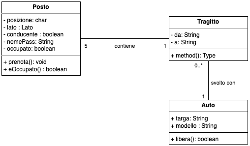

# Prenotazioni Car Sharing
(Lezione del 7 Marzo 2024)

Si vuole realizzare un sistema di prenotazione dei posti su auto in car sharing.

## Posti

- Un posto è caratterizzato da **posizione** (anteriore o posteriore) e **lato** (sinistro, destro, centrale), ad esempio `Anteriore sinistro`. 

- Inoltre il posto può essere quello del conducente.

- Deve essere possibile prenotare un posto fornendo il nome del passeggero.

- Inoltre deve essere posssibile sapere se un posto è prenotato o meno.

- Infine deve essere possibile cancellare la prenotazione, liberando il posto.

## Tragitti

Quando si definisce un tragitto vengono inizializzati i posti inizialmente vuoti tranne quello del conducente, che è occupato dal conducente.

Per un tragitto è necessario poter definire e sapere i luoghi di partenza e destinazione, il tempo stimato (in ore) e i costo richiesto.

Dato un tragitto deve essere possibile prenotare un posto. Viene assegnato il primo disponibile.

Deve essere possibile cancellare la prenotazione di un passeggero.

Inoltre deve essere possibile sapere quanti posti liberi ci sono.

---

